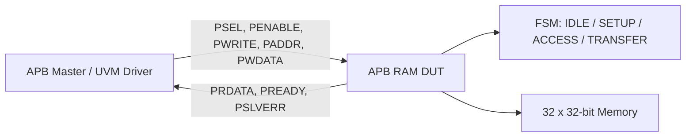
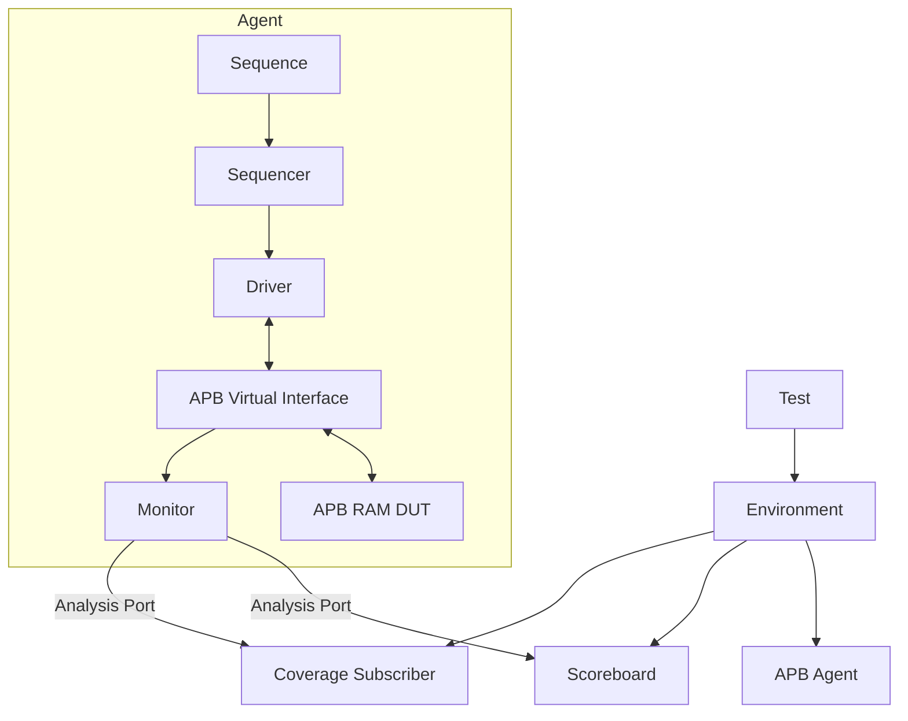
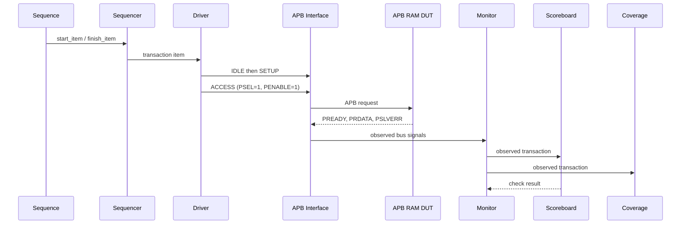

# Editable Mermaid diagrams

These diagrams can be pasted into GitHub Markdown or Mermaid Live Editor.

## DUT block diagram

```mermaid
flowchart LR
  M[APB Master / UVM Driver] -->|PSEL, PENABLE, PWRITE, PADDR, PWDATA| D[APB RAM DUT]
  D -->|PRDATA, PREADY, PSLVERR| M
  D --> F[FSM: IDLE / SETUP / ACCESS / TRANSFER]
  D --> MEM[32 x 32-bit Memory]
```

## UVM architecture

```mermaid
flowchart TB
  T[Test] --> E[Environment]
  E --> A[APB Agent]
  E --> S[Scoreboard]
  E --> C[Coverage Subscriber]
  subgraph Agent
    Q[Sequence] --> SQ[Sequencer]
    SQ --> DR[Driver]
    DR <--> VIF[APB Virtual Interface]
    VIF <--> DUT[APB RAM DUT]
    VIF --> MON[Monitor]
  end
  MON -->|Analysis Port| S
  MON -->|Analysis Port| C
```

## Transaction flow

```mermaid
sequenceDiagram
  participant SEQ as Sequence
  participant SQ as Sequencer
  participant DR as Driver
  participant VIF as APB Interface
  participant DUT as APB RAM DUT
  participant MON as Monitor
  participant SCO as Scoreboard
  participant COV as Coverage

  SEQ->>SQ: start_item / finish_item
  SQ->>DR: transaction item
  DR->>VIF: IDLE then SETUP
  DR->>VIF: ACCESS (PSEL=1, PENABLE=1)
  VIF->>DUT: APB request
  DUT-->>VIF: PREADY, PRDATA, PSLVERR
  VIF->>MON: observed bus signals
  MON->>SCO: observed transaction
  MON->>COV: observed transaction
  SCO-->>MON: check result
```
